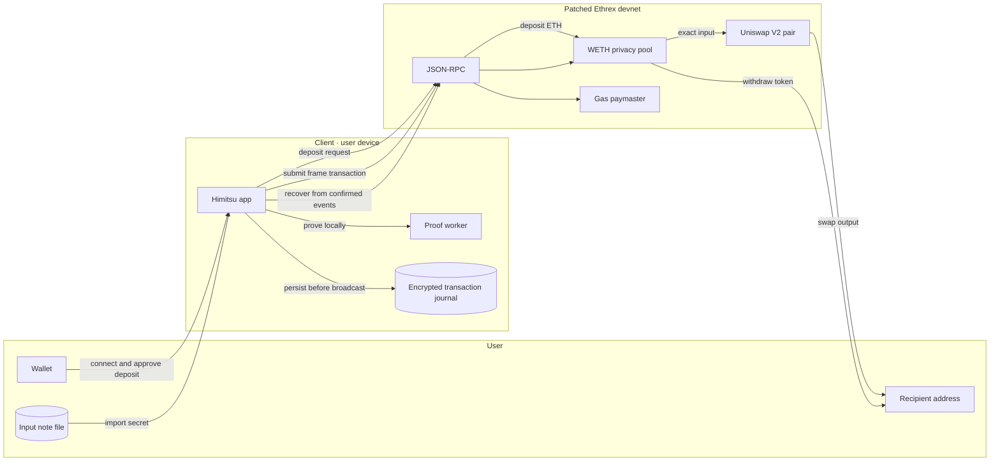
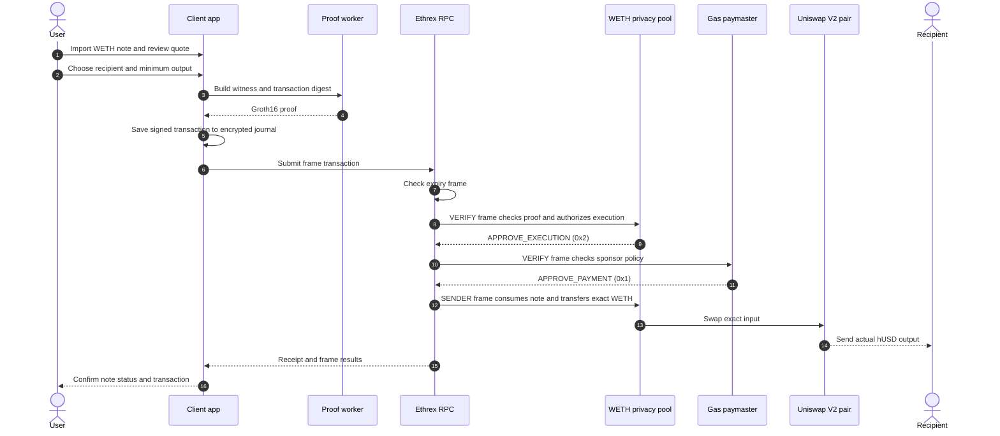

# Himitsu

Private-note withdrawals and swap-and-withdrawals through Uniswap, authorized by native frame transactions.

Himitsu lets a user spend a private balance without an application-operated relayer or bundler,
and without granting the exchange a token allowance. The client generates a zero-knowledge proof,
constructs an EIP-8141 frame transaction, and submits it directly to RPC. The pool authorizes the
spend; a prefunded onchain paymaster independently authorizes gas payment. Neither step requires an
operator's per-transaction signature.

Users choose one of two actions after importing a note: withdraw its token directly, or swap it
through a Uniswap V2 pair and send the output to a chosen address in the same transaction. The
swap output is public and does not create a second private note.

Built with **EIP-8141, Uniswap V2, Circom + Groth16, Poseidon, Ethrex, Next.js, and Family ConnectKit**.
The current implementation runs on a pinned, patched Ethrex devnet with test assets. It is not
audited or intended for real funds.

## How it works

1. **Deposit and save a note.** Connect a wallet through ConnectKit, generate a private note, and
   download it before approving a 0.1 ETH deposit. The input pool wraps ETH into WETH and inserts an
   amount-bound commitment into its Merkle tree.
2. **Choose an action.** Import the note and choose **Swap and withdraw** or **Withdraw**. For a
   swap, review the live Uniswap quote, slippage limit, and public recipient address.
3. **Prove and authorize.** A client-side worker generates a Groth16 proof of note membership and
   spending authority, bound to the transaction digest. Verification frames check expiry, validate
   the proof, and approve gas payment under the paymaster's policy.
4. **Settle atomically.** A sender frame consumes the input nullifier. For a swap it sends the exact
   input to the pair, enforces the minimum output, and routes the result directly to the recipient.
   For a withdrawal it sends the note's token directly to the recipient. Any failure rolls back the
   spend, so the input note remains unspent.

The wallet pays deposit gas. The prefunded paymaster pays eligible private-spend gas, including gas
consumed by included failed attempts. Private swaps and withdrawals do not request wallet signatures.

## Architecture



The client creates proofs and stores transaction history locally. It sends transactions and recovery
queries straight to RPC; there is no app relayer, proving server, or hosted indexer. The wallet is
used for deposits only. Private swaps and withdrawals are authorized by the note proof.

## Swap transaction



If the swap fails or returns less than the minimum, the spend rolls back and the input note remains
unspent. An included failed attempt may still consume paymaster funds. Swap amounts and recipient
addresses are public; the proof hides which deposit authorized the input spend.

**Diagram notation:** brackets after instruction names identify opcode bytes. Approval-scope values
are separate operands/permissions, not additional opcodes. `VERIFY` and `SENDER` are frame modes.
The expiry verifier at address `0x8141` is a contract target, not an opcode.

| Approval scope | Value | Use in this flow |
| --- | --- | --- |
| `APPROVE_NONE` | `0x0` | Expiry and sender frames cannot grant approval; they do not call `APPROVE` with zero scope. |
| `APPROVE_PAYMENT` | `0x1` | Paymaster approves the transaction's gas payment. |
| `APPROVE_EXECUTION` | `0x2` | Pool approves execution; the resolved verification target must equal the transaction sender. |
| `APPROVE_EXECUTION_AND_PAYMENT` | `0x3` | Combined authorization, not used in this sponsored flow: pool and paymaster approve separately. |

See the [EIP-8141 approval specification](https://eips.ethereum.org/EIPS/eip-8141#approve-instruction-0xaa).

Note secrets and Merkle witnesses stay on the user device. Only proofs and public transaction data
are submitted. Tree reconstruction and note recovery use RPC directly; the MVP has no hosted
indexer, proving server, or application database. RPC infrastructure and block production remain
necessary.

## Native authorization with EIP-8141

The transaction sender is the privacy pool contract. Execution authority comes from the note proof;
gas-payment authority comes from a separate contract. Both decisions are made within the transaction.

| Instruction | Role in Himitsu |
| --- | --- |
| `APPROVE` (`0xaa`) | Pool authorizes execution with scope `0x02`; paymaster authorizes payment with scope `0x01`. |
| `TXPARAM` (`0xb0`) | Reads the canonical authorization digest, sender, fee bounds, maximum cost, and frame context. |
| `FRAMEDATALOAD` (`0xb1`) | Paymaster checks function selectors in other frames. |
| `FRAMEDATACOPY` (`0xb2`) | Execution retrieves the nullifier, recipient, and amount from the successful verification frame. |
| `FRAMEPARAM` (`0xb3`) | Checks frame targets, modes, budgets, scopes, and earlier verification results. |
| `SIGPARAM` (`0xb4`) | Checks the arbitrary-signature entry's scheme, message selection, and proof length. |
| `SIGDATACOPY` (`0xb5`) | Retrieves the Groth16 proof carried in that entry. |

The validator binds the full 256-bit transaction digest as two 128-bit public inputs. The canonical
authorization digest omits the raw proof bytes, avoiding self-reference. A valid
proof does not authorize arbitrary pool operations: the pool and sponsor constrain the frame layout
and permitted actions before granting approval.

Native `APPROVE` is **not** ERC-20 `approve()`. The former authorizes transaction execution or payment;
the latter grants token spending permission. Our swap atomicity comes from one contract call, not
from using the cross-frame atomic-batch flag.

Implementation targets: **Ethrex `d587cf9ff0996315381c4b2784a4d7d499decc0f` (`frames-devnet-0`)** and
**EIP encoding/introspection revision `ethereum/EIPs@b75cbe6115`**. The proposal is evolving; these
pins describe the tested implementation. There is no claim of EIP-8286 conformance.

## Uniswap integration

Himitsu uses the official `@uniswap/v2-core` contracts deployed with local test liquidity. The current
route is WETH ↔ hUSD; it is not an arbitrary-token router.

| Integration | Review the implementation |
| --- | --- |
| Exact-input swap, minimum output, direct payment to recipient | [`HimitsuPoolV2.sol`, `spendAndSwapToRecipient()`](packages/protocol/contracts/src/HimitsuPoolV2.sol#L280) |
| Proof validation and permitted execution layout | [`HimitsuPoolV2.sol`, `validateSpend()`](packages/protocol/contracts/src/HimitsuPoolV2.sol#L193) |
| Fresh token backing for deposited notes | [`HimitsuPoolV2.sol`, `depositTokenAmount()`](packages/protocol/contracts/src/HimitsuPoolV2.sol#L153) |
| Client-side frame construction and submission | [`controller.ts`, `spend()`](app/src/lib/controller.ts#L284) |
| Onchain sponsorship policy | [`paymaster.ts`, `buildPaymaster()`](packages/contracts/src/paymaster.ts#L55) |
| Pair deployment and initial liquidity | [`deploy-app-v2.mjs`](packages/protocol/deploy-app-v2.mjs) |
| Reserve-based quotes and readiness checks | [`market.ts`](packages/client/src/market.ts) |

There is no allowance to the Uniswap pair or router. In **Swap and withdraw**, Uniswap sends output
tokens directly to the recipient. Initial ERC-20 deposits can require an allowance; the ETH deposit
flow does not. Direct pair transfers are an existing Uniswap capability. Himitsu combines them
with private-note spending, proof-bound minimum output, and native frame authorization.

## Enforced properties and limits

- **Specific authorization.** The proof binds the transaction, note amount, recipient, and nullifier.
  Spent-nullifier tracking prevents double-spending.
- **Bounded sponsorship.** Immutable policy restricts eligible pools, transaction shape, and fee/gas
  limits. No operator signs each sponsorship approval. These bounds do not prevent repeated subsidy
  consumption by a valid note holder.
- **Atomic settlement.** A failed swap or recipient transfer leaves the input unspent. Included failures
  can still cost sponsor gas. Fresh backing checks prevent unsolicited donations being claimed as notes.
- **Recoverable confirmed funds.** A downloaded note can recover its confirmed deposit and amount in
  a fresh client. The checksum detects file damage; it does not authenticate ownership or encrypt it.
- **Conservative retries.** The raw transaction is encrypted and saved before broadcast. Uncertain
  outcomes remain reserved until reconciliation; there is no automatic reproving or replacement.

**Privacy boundary.** The proof does not directly identify which deposited commitment authorized a
spend. Amounts, timings, AMM activity, withdrawal addresses, and network metadata remain observable
and can enable correlation. Direct RPC submission does not provide network anonymity.

**Custody boundary.** Tokens are held by pool contracts; downloaded notes are unencrypted bearer
secrets. Anyone holding a note can spend it, and losing it can lose access. Local AES-GCM caches are
unlocked from note-derived key material, not a user password. Clearing client data loses pending
history even when saved files can recover confirmed funds. Use one active client per note.

**MVP boundary.** Trees have depth 10 and hold at most 1,024 commitments each; spent notes do not free
slots. Users share a pool nonce, so concurrent spends can require explicit retries. Two-block
confirmation is a devnet policy, not finality. The proving setup is development-only, and the system
has not received an independent security audit.

## Repository layout

```text
app/                         Next.js UI, ConnectKit, proof worker, client-side transaction controller.
packages/client/             RPC verification, private-note format, Merkle trees, encrypted storage,
                             quotes, event reconstruction, and receipt/nonce reconciliation.
packages/frame-codec/        Frame encoding, authorization hashes, and rollback-aware outcomes.
packages/contracts/          Immutable native paymaster bytecode generator and policy tests.
packages/protocol/           Solidity pools/verifiers, Circom circuits, frame helpers, Uniswap
                             artifacts, and deployment/integration scripts.
scripts/                     Readiness checks and native client, market, and private-note tests.
deployments/                 Deployment records and public transaction evidence.
patches/                     Required patch for the pinned Ethrex mempool simulator.
docs/                        Recovery, accounting, implementation provenance, and validation details.
```

Bun manages the workspace. Protocol/proving scripts run under Node because snarkjs worker execution
crashed under the tested Bun runtime. The client and contracts use the Himitsu commitment domain.
Unchecked pools and stock verifiers are comparison fixtures, not app deployment choices.

## Local transaction explorer

Open **http://127.0.0.1:3000/explorer** while the configured Ethrex node is running.
Search by transaction hash or decimal block number, browse recent blocks, or select
**View transaction** in the app's transaction history. The explorer reads the selected deployment's
RPC directly and verifies its chain ID and genesis. No indexer, wallet connection, or private-note
storage is needed.

Transaction details include the actual gas payer, receipt status, per-frame execution/state gas,
allowed approval scopes, token transfers, allowance changes, and public note commitments.
Missing receipts and skipped frames are not shown as successful. Use **Refresh** for updated data;
recent blocks are a paginated snapshot rather than a complete transaction index.

## Running locally

### Prerequisites

- Bun **1.3.9**, Node.js, and Foundry's `cast` for deployment/native integration scripts.
- The pinned Ethrex checkout with [`ethrex-prefix-frame-results.patch`](patches/ethrex-prefix-frame-results.patch)
  applied and rebuilt. It fixes missing prior-frame results in mempool simulation, needed by our sponsor.
- Matching circuit WASM, proving keys, and generated protocol artifacts. Circom is required if
  regenerating circuits; Solidity builds use pinned solc-js versions.

### Start the existing demo chain

Run from the Himitsu repository root. Adjust `ETHREX_DIR` to your checkout. Use the same data directory
to retain deployed contracts and notes; do not run two nodes against it.

```bash
bun install
export ETHREX_DIR="$HOME/Desktop/ethrex"
mkdir -p .local
"$ETHREX_DIR/target/release/ethrex" --dev \
  --network "$ETHREX_DIR/fixtures/genesis/l1-hegota.json" \
  --datadir "$PWD/.local/ethrex-debug" \
  --authrpc.jwtsecret "$PWD/.local/jwt-debug.hex" \
  --http.port 8567 --authrpc.port 8573 \
  --mempool.max-verify-gas 1000000
```

In another terminal, reuse the published deployment:

```bash
bun run doctor --app
bun run dev
```

Open **http://127.0.0.1:3000** for the homepage, then select **Launch app**
(or go directly to **http://127.0.0.1:3000/app**) for the private swap demo.
The homepage works without a wallet connection or a running node. The manifest at `app/public/deployment.json` pins the RPC, chain/genesis,
deployment anchor, contract runtime hashes, and proving-asset hashes. `doctor --app` checks identity,
liquidity, backing, and sponsor funding; it does not reserve those resources.

### Deploy onto a fresh demo chain

Only use this path for an intentional new deployment. Deployment scripts use local test funding
fixtures and must not target real funds. Existing notes remain tied to their original pools.

```bash
bun run build:protocol
# Bootstrap the V1 manifest required by the current V2 publisher on a fresh workspace.
RPC_URL=http://127.0.0.1:8567 bun run deploy:app
# Publish the V2 pools, Uniswap liquidity, automatic sponsor, and client-side proving files.
RPC_URL=http://127.0.0.1:8567 bun run deploy:app:v2
bun run doctor --app
```

This expects the matching V2 circuit artifacts to exist. If rebuilding the development setup is
necessary, see [`setup-v2.mjs`](packages/protocol/setup-v2.mjs) and run `bun run setup:v2` before V2
deployment. Do not regenerate ceremony files during ordinary startup or mix keys with an existing
verifier. Deployment supplies test liquidity and funds sponsorship; keep the node data afterward.

### Wallet configuration

Injected wallets work without an API key. To enable WalletConnect, create `app/.env.local`
from [`app/.env.example`](app/.env.example) and supply your public project ID:

```dotenv
NEXT_PUBLIC_WALLETCONNECT_PROJECT_ID=your_project_id
```

Restart the app after setting it. ConnectKit supports account/disconnect controls and switching to
the configured devnet. Deposit requests recheck the active account, connector, and network. A mobile
wallet needs a reachable RPC; the laptop's `127.0.0.1` endpoint is not reachable from a phone.

The integration pins ConnectKit 1.9.1, Wagmi 2.15.6, and TanStack Query 5.103.2. ConnectKit declares
React 17/18 peers while the app uses React 19.3.0: builds pass, but wallet-modal runtime compatibility
still needs local client verification. See [Family's setup guide](https://family.co/docs/connectkit/getting-started).

### Hosting the demo

The intended topology is a static/frontend host such as Vercel plus a persistent Ethrex node behind
HTTPS RPC. This is a deployment plan, not a claim of an already-hosted service. Publish the correct
RPC and matching manifest/proving assets with the frontend; generated files excluded from Git must
be supplied to the hosting build. No separate application backend is required.

User secrets stay on user devices. Deployer/funding keys and the Engine API JWT stay outside frontend
assets. The WalletConnect project ID, circuit WASM, proving key, and verification key are public.
A fresh hosted chain requires fresh contract deployment; switching RPC URLs does not migrate state.

## Tests and evidence

Static checks and unit tests:

```bash
bun run check
bun run typecheck:app
bun run build:app
```

Native tests against the existing local V2 deployment, using test assets:

```bash
bun run test:private-notes
bun run test:market
bun run test:readiness
RPC_URL=http://127.0.0.1:8567 bun run test:v2-deposits
```

- **Private notes:** deposit, fresh-file import, real proof-based swap, simulated loss of an accepted
  RPC response, note-only reopening of the encrypted journal, output-amount recovery, withdrawal,
  and spent/duplicate-note rejection.
- **Market execution:** slippage failure after an intervening trade, rollback, explicit retry, full
  output recovery, and withdrawal.
- **Readiness and backing:** wrong chain/code, stalled head, wrong pair, insufficient sponsorship,
  unclaimable donations, amount bounds, and cleared output-pool allowance.
- **Unit coverage:** frame hashes, receipt rollback, sponsorship policy, encrypted persistence,
  note parsing, canonical recovery, nonce reconciliation, and wallet-change guards.

The latest recorded unit run passed **67 tests / 145 assertions**. TypeScript checks and the
production build passed. Public native-flow evidence is in
[`private-note-evidence.json`](deployments/private-note-evidence.json),
[`app.v2-market-evidence.json`](deployments/app.v2-market-evidence.json), and
[`app.v2-deposit-evidence.json`](deployments/app.v2-deposit-evidence.json).

The private-note UI and ConnectKit flow have **not** been exercised end to end in a browser.
Native client scripts exercise transaction construction and chain behavior. See [`app-validation.md`](docs/app-validation.md)
for the distinction. `test:client` retains historical phrase-recovery and nonce-contention regression
coverage; phrase recovery is no longer an app workflow. Tests are evidence of the checked behavior,
not an audit or a proof of production safety.

## Future scope

- **Concurrent spending.** Reduce shared-pool nonce contention without weakening replay protection.
- **Sustainable gas payment.** Replace open-ended demo subsidy with a reviewed funding and abuse-control model.
- **Broader Uniswap integration.** Explore newer routing and pool versions while preserving exact authorization and recipient protections.
- **Privacy and usability.** Address amount/timing correlation and improve note custody without introducing a secret-holding backend.
- **Larger pools.** Extend tree capacity and recovery performance beyond the current fixed-depth demo.
- **Production readiness.** Independent audits, an appropriate proving ceremony, supported network execution, and operational validation.

## Further reading

- [Private-note format, storage, and recovery](docs/private-notes.md)
- [V2 accounting and market-swap behavior](docs/market-swaps-v2.md)
- [Validation history and limitations](docs/app-validation.md)
- [Original implementation provenance](docs/import-provenance.json)
- [EIP-8141 proposal](https://eips.ethereum.org/EIPS/eip-8141)

### Deployment compatibility

The Himitsu Merkle zero-leaf domain is defined consistently in the client and contract sources.
Deployments created with the former domain are incompatible; use matching artifacts and a fresh deployment.
`docs/implementation-plan-source.md` preserves the original plan with Himitsu naming for provenance.

### Bidirectional swaps and withdrawals

Select **Bidirectional swaps · v2** for WETH ↔ hUSD. The **Reverse direction** button changes the
input token; importing a note selects its direction automatically. Choose **Swap and withdraw**
to trade the full note and send the output directly to a recipient, or **Withdraw** to send the
original token. Review the quote, minimum output, recipient, and privacy warning before confirming.

Both pools in this deployment accept variable amounts (`denomination = 0`). The UI still
uses a default ETH deposit of 0.1 ETH (`defaultDepositAmount`). Older fixed-WETH deployments
remain in the deployment selector for existing notes and withdrawals; they cannot receive
variable WETH swap outputs. The test token is named **Himitsu USD (hUSD)**; archived contracts
retain their original onchain metadata.

Run `RPC_URL=http://127.0.0.1:8567 bun run test:bidirectional` with the local node running.
This sends test transactions: deposit → private-note swaps and withdrawals → direct swap-and-withdraw.
It verifies note-file recovery, atomic rollback, exact withdrawal amounts, direct recipient payment,
minimum output protection, no output-pool credit for direct swaps, and zero exchange/pool allowances. Transaction hashes
are recorded in `deployments/bidirectional-evidence.json`.

### Fixed-denomination deposits and withdrawals

Select **Fixed notes · 0.1 ETH deposit / 0.1 WETH withdrawal** in the app. Deposit exactly
0.1 ETH, save the private note, then import it to withdraw exactly 0.1 WETH to a recipient.
The paymaster funds the withdrawal gas, so the recipient needs no ETH balance. Withdrawals
return WETH (not native ETH). Wrong amounts are rejected by the contract; spent notes cannot
be reused. New fixed pools also reject swap execution in their validation layout, and their
paymaster authorizes withdrawals only.

Equal denominations remove distinctive amounts as a way to distinguish notes within this pool.
They do not hide deposits, withdrawal recipients, amounts, timing, or network metadata, and do
not guarantee unlinkability. Practical privacy depends on other users and their activity; the
local demo is not evidence of a meaningful anonymity set. Private notes must remain secret.

This first UI supports ETH deposits into the fixed WETH pool. It does not convert variable swap
outputs into fixed notes or handle swap remainders. The existing **Bidirectional swaps · v2**
deployment remains selectable, with its original notes and variable outputs unchanged.

Local deployment: `RPC_URL=http://127.0.0.1:8567 bun run deploy:app:fixed`.
Integration test: `RPC_URL=http://127.0.0.1:8567 bun run test:fixed`.
The test deposits three equal notes, imports each into a fresh cache, withdraws to unfunded
addresses, checks exact balances, and rejects wrong amounts and repeated spends. Public test
transaction hashes are saved in `deployments/fixed-evidence.json`.
